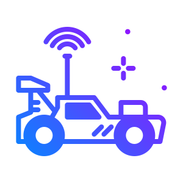

  

<h3 align="center">RC CAR PROJECT</h3>

## 🏁 DESCRIPTION AND REQUIREMENT
    - 2 wireless network interfaces are needed (wlan0 and wlan1)
    - wlan0 is converted to uap0
    - wlan1 is connected to internet
    - br0 connects uap0 to wlan1

## 🚀 HOW TO RUN
    - go to raspberry pi
    - login as root user (sudo bash / sudo su)
    - 🧧 go to project_wifi_extender
    - chmod a+x configure.sh install_pre.sh start.sh
    - run install_pre.sh (once required)
    - go to network_files/wpa_supplicant.conf and add ssid and pass of internet network
    - run configure.sh script
    - After reboot ru nstart script (./start.sh)

## 💣 HOW TO REVERT
    -run configure.sh script with back as 1st param (./configure back)

## ✍️ Team Members 
    🚗 Johanna Nygård
    🚗 Santeri Rauhal
    🚗 Roni Kekkonen 
    🚗 Maija Somero
    🚗 Elisa Urjansson
